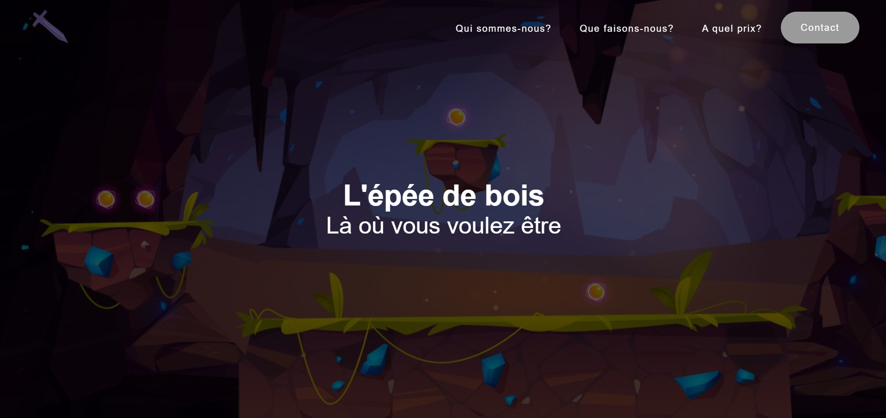

<div align="center">
  <h1 align="center">Event Website</h1>
    <p align="center">
    Our Event Company website developed using HTML, CSS, and JavaScript.
</div>

## About The Project

This project was created with two other classmates as part of a university course. The website aims to provide a professional and user-friendly interface for an event company, featuring sections for services, testimonials, and contact information.

## Built With

[](https://developer.mozilla.org/en-US/docs/Web/HTML)  
[](https://developer.mozilla.org/en-US/docs/Web/CSS)  
[](https://developer.mozilla.org/en-US/docs/Web/JavaScript)

## Getting Started

### Folder Structure

```markdown
EventWebsite/
├── 📁 src/                  # Source files
│   ├── 📁 Images/           # Image assets
│   ├── 📁 Styles/           # CSS files
│   └── 📄 sae.html          # Main HTML file
└── 📄 README.md             # Project documentation
```

### Installation & Usage

1. Clone the repository:

```sh
git clone https://github.com/JulesBobeuf/EventWebsite.git
cd EventWebsite/src
```

2. Open `sae.html` in your preferred web browser to view the website.

## License

This project is licensed under the MIT License. See the [LICENSE](LICENSE) file for details.

## Contact

Jules Bobeuf  
[LinkedIn](https://www.linkedin.com/in/bobeuf-jules/)  
bobeuf.jules@gmail.com

Elsa Logier  
[LinkedIn](https://www.linkedin.com/in/elsa-logier-2bb692254/)

Thomas Santoro  
